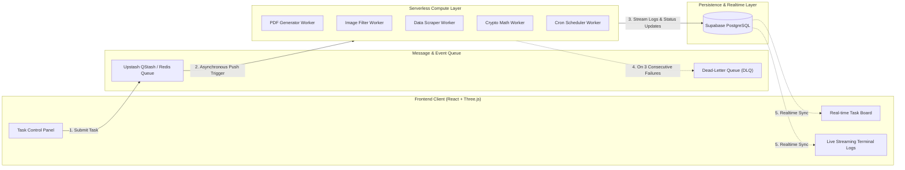

# Cloud-Based Serverless Task Processing System

> **A Distributed Asynchronous Task Processing Platform with Real-Time Observability, Exponential Backoff Retries, Dead-Letter Queue (DLQ) Fault Tolerance, and Interactive 3D Cloud Topology Visualization.**

---

## 🌟 Key System Capabilities

1. **5 Concrete Serverless Workloads**:
   - 📄 **PDF Performance Audit Generator**: Generates formatted, downloadable vector PDF documents with custom typography and data tables.
   - 🖼️ **Image Processing & Filter Matrix**: Applies asynchronous canvas filters (cyber glow, compression, matrix sharpening) and provides image preview artifacts.
   - 📊 **Big Data Aggregator & Scraper**: Simulates fetching 1,250+ records and computes statistical percentiles (`p50`, `p95`, `p99`) and health scores.
   - ⚡ **Heavy Cryptographic & Matrix Computation**: Simulates cryptographic hashing and matrix eigenvalue computations without blocking UI responsiveness.
   - ⏰ **Scheduled Health Heartbeat (Cron)**: Automated periodic health probes triggered via serverless scheduler.

2. **Enterprise-Grade Fault Tolerance (Standout Academic Feature)**:
   - **Chaos / Failure Simulator**: Test system resilience under simulated worker crashes (504 Gateway Timeouts).
   - **Exponential Backoff Retries**: Automatically retries failed tasks with progressive delays ($2^n$ seconds: 2s, 4s, 8s).
   - **Dead-Letter Queue (DLQ) Inspector**: Isolates persistently failing tasks for payload inspection and offers 1-click replay.

3. **Real-Time Observability & Telemetry**:
   - **Interactive 3D Serverless Network Topology** rendered via Three.js.
   - **Live Streaming Terminal Console** with color-coded logs (INFO, WARN, ERROR, SUCCESS, DEBUG).
   - **Performance Analytics**: Sub-second execution latency distribution charts and workload mix breakdown.
   - **Exportable PDF Audit Report**: 1-click downloadable project verification report.

---

## 🏗️ Architecture Overview



---

## 🚀 Quick Start (Running Locally)

### 1. Install Dependencies
```bash
npm install
```

### 2. Start Local Development Server
```bash
npm run dev
```
Open your browser at `http://localhost:5173`.

---

## ☁️ Cloud Database Setup (Supabase)

1. Open your project on **[supabase.com](https://supabase.com)**.
2. Go to the **SQL Editor** tab.
3. Paste the contents of [`supabase_schema.sql`](./supabase_schema.sql) and click **RUN**.
4. All tables (`tasks`, `task_logs`, `dead_letter_queue`, `worker_metrics`) and realtime policies will be created instantly.

---

## 🚀 Cloud Deployment (100% Free Tier)

### Deploy to Vercel via GitHub:
1. Initialize git and push to your repository:
   ```bash
   git init
   git add .
   git commit -m "feat: complete cloud serverless task processing system"
   git remote add origin https://github.com/deliveRance123/replyme.git
   git branch -M main
   git push -u origin main --force
   ```
2. Open **[vercel.com](https://vercel.com)** -> Click **"Add New Project"** -> Import your `replyme` repository.
3. Add your Environment Variables in Vercel settings (from your `.env` file).
4. Click **Deploy**! Your site is live on a global CDN.
